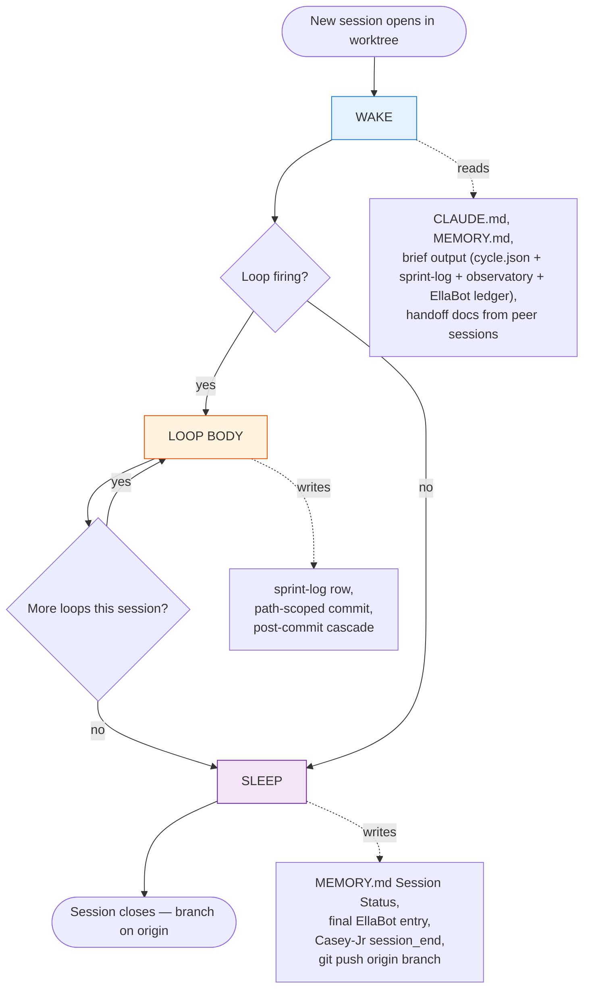
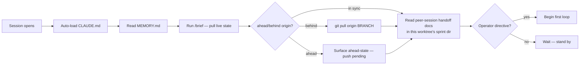
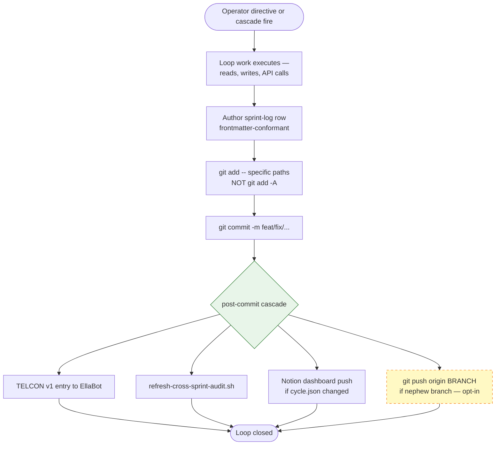
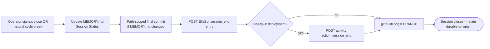
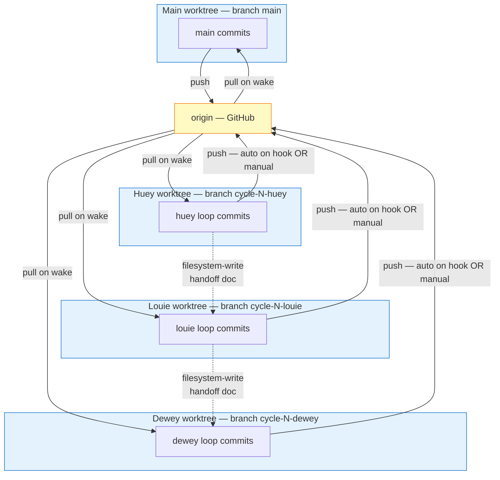

# Session & Loop Orchestration

*The canonical flow for how a single Claude Code session executes within a Foreman^^ project — wake, per-loop body, sleep — and how multiple parallel sessions stay in sync. Use this doc as a verification checklist after a loop fires: did each step happen? If not, what compensating action is needed?*

This doc is companion-paired with:
- **`memory-framework.md`** — what persists between sessions
- **`three-sprint-cascade.md`** — how the trio (huey/louie/dewey) coordinates
- **`hitl-cadence.md`** — when operator gates fire
- **`setup-post-commit-hook.md`** — the per-commit cascade this assumes

## High-level flow



## WAKE — session start ritual

What every session does in its first turn before any work fires:



**Wake checklist** (verify each fired):
- [ ] CLAUDE.md auto-loaded into context (handled by Claude Code natively)
- [ ] MEMORY.md read (Session Status block confirms current cycle / sprint anchor)
- [ ] `/brief` invoked — surfaces `.foreman/cycle.json`, sprint-log tails, observatory rollup, ledger entries
- [ ] `git status -sb` checked — current branch, ahead/behind origin reported
- [ ] If behind origin: pull/rebase before any work fires
- [ ] If ahead origin: surface to operator (something didn't push in a prior session)
- [ ] Handoff docs in `docs/foreman/sprints/<SPRINT>/` read for any starter-prompt or `from-<peer>-handoff` content
- [ ] Operator directive received (or session waits)

**Red flags at wake**:
- "0 ahead / 0 behind" but the brief shows old observatory data → observatory regen lag, not a sync issue
- Behind origin: another session pushed work; **stop, pull, re-orient before firing**
- Ahead origin without operator memory of prior session: investigate before doing anything destructive

## LOOP BODY — per-loop cascade

The unit of progress in a sprint. One loop = one bounded piece of work that fires a sprint-log row and a single commit.



**Per-loop checklist** (verify after each loop fires):
- [ ] Sprint-log row appended with all standard fields (outcome, artifacts_landed, ledger_delivery, honesty_flag)
- [ ] Commit message follows convention `<type>(<sprint-slug>): L## — <title>`
- [ ] Path-scoped staging used (`git add -- <files>` not `git add -A`) — prevents parallel-session contamination
- [ ] Post-commit hook fired:
  - [ ] EllaBot entry POSTed (check `id` returned, `actor` field correct, `sprint_code` tagged for /brief filter visibility)
  - [ ] `observatory/data/cross-sprint-audit.json` refreshed (touched, mtime current)
  - [ ] Notion dashboard pushed if `.foreman/cycle.json` was in commit
  - [ ] Auto-push to origin fired if branch matches `cycle-*-{huey,louie,dewey}` (opt-in via env var; see `setup-post-commit-hook.md`)
- [ ] If artifacts span Casey-Jr deployment scope: `POST /deployments/{id}/activity` with action=`commit`

**Red flags per loop**:
- Sprint-log row missing → loop wasn't bounded; refire as compound or split
- Hook silently failed (commit landed, EllaBot has no entry) → check `~/.local/share/git-post-commit-hook/log` for errors
- `git add -A` used and parallel session has staged work in the same worktree → contamination risk; check what got pulled in
- Auto-push enabled but commit didn't show on origin → check the auto-push log for branch-pattern miss

## SLEEP — session-end ritual

What every session does before closing — even if work continues in another session:



**Sleep checklist**:
- [ ] `MEMORY.md` Session Status updated (status, current focus, blockers, next steps, last_updated date)
- [ ] If MEMORY.md changed: path-scoped commit (`git add -- MEMORY.md && git commit`)
- [ ] Final EllaBot entry POSTed with `action: session_end` (or equivalent) — provides cross-session visibility into when this session wrapped
- [ ] If Casey-Jr deployment associated: activity entry with `action: session_end`, `summary: <brief recap>`
- [ ] **`git push origin <current-branch>`** — non-negotiable; the work isn't durable until it's on origin
- [ ] All decisions worth remembering have been captured (in MEMORY.md Decisions section, or in feedback memory files, or in commit messages)

**Red flags at sleep**:
- MEMORY.md not updated since session start → next session has no breadcrumb
- Branch ahead of origin at sleep → **single-point-of-failure exposure**; must push before closing
- Committed work that never got an EllaBot entry → ledger gap; backfill before close

## Cross-session synchronization

Multi-session orchestration is where the framework breaks if discipline slips. The persistent-worktree pattern (charter §12.3.b) introduced a sync gap: nephew branches can sit unpushed indefinitely.



**Sync points worth knowing**:
1. **Session wake** — pull origin to catch peer-session work before authoring anything new
2. **Per-commit auto-push** (opt-in) — keeps nephew branches durable on origin without operator memory
3. **Handoff handoffs** — sometimes peer-session context needs to bridge synchronously; write a handoff doc directly into the receiving worktree's sprint dir (filesystem-write, then peer session reads on its next /brief)
4. **Cycle-close merge ceremony** — at sprint-cascade-terminal points, merge nephew branches → main and push (charter §12.3.b)

**Red flags across sessions**:
- Two sessions producing artifacts that reference each other but neither has pushed → silent divergence; the first to push wins, the other has to rebase
- A nephew session does `git add -A` while main session has staged work → parallel-session contamination (see `feedback_parallel_session_contamination.md`)
- A handoff doc gets written into the wrong worktree → receiving session never sees it; check the worktree path before filesystem-writing across boundaries

## Verification — "did the loop do what it was supposed to?"

Quick post-loop audit. Run this whenever you're not sure if everything cascaded:

```bash
# 1. Sprint-log row exists
grep -A 10 "L<NN>" docs/foreman/sprints/<SPRINT>/sprint-log.md

# 2. Commit landed
git log --oneline -5 -- docs/foreman/sprints/<SPRINT>/sprint-log.md

# 3. EllaBot entry landed
curl -s "$ELLABOT_URL/api/v2/entries?source_ref=<sprint-slug>_l<NN>_end" | jq

# 4. Observatory audit refreshed
ls -la observatory/data/cross-sprint-audit.json

# 5. Branch on origin
git status -sb  # should show "0 ahead" if auto-push or manual push fired

# 6. Casey-Jr activity (if applicable)
curl -s "$CASEY_URL/api/deployments/<id>/activity" | jq
```

If any of those return empty or stale, that's a compensating-action target — not a panic, but a backfill.

## Portability across projects

The flow above is project-agnostic. Any repo following the dacumen memory-framework + three-sprint-cascade pattern can use this as the orchestration spec. Project-specific overlays (e.g., darntech's deployment-to-CT-100, sprite-forge's ComfyUI integration) layer on top of these stages without changing the underlying shape.

When bootstrapping a new project: the wake / loop / sleep skeleton is the same; only the artifacts (which APIs, which sprint dirs, which deploy commands) change.

---

_Authored 2026-04-27 in response to a multi-worktree orchestration gap surfaced during cycle-06 — 21 commits across 4 repos exposed as unpushed local-only state. Codified as canonical reference so future sessions don't re-derive the discipline._
